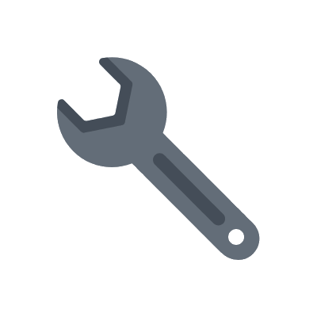

#  Hello world, i'm SamLatsin

I'm passionate self-taught full stack web developer and a freelance software engineer. My passion for software lies with dreaming up ideas and making them come true. I take great care in the experience, architecture, and code quality of the things I build. I'm always learning. Currently pursuing my master's degree in computer science from [BMSTU](https://bmstu.ru/).

##  LANGUAGES & TOOLS

### BACKEND

 
    
   
   
   
   
   
   
   
   

### MOBILE

 
   
   
   
   
   
   
   
   

### FRONTEND

 
  
   
   
   
   

### SYSTEM TOOLS

 
   
   
   
   
   
   

### MICROCONTROLLER PROGRAMMING

 
   
   
   
  
   

### OTHER

 
   
   
   
   
  
   
   
   
   
   

##  MY PROJECTS

##  GITHUB STATS

  

    
    
    
 
      
    

     
    <i><b>Note:</b> Top languages is only a metric of the languages my public code consists of and doesn't reflect experience or skill level.</i>
  

  

  

    
  
 

  

 
  

    
  

    

<!--
**SamLatsin/SamLatsin** is a ✨ _special_ ✨ repository because its `README.md` (this file) appears on your GitHub profile.

Here are some ideas to get you started:

- 🔭 I’m currently working on ...
- 🌱 I’m currently learning ...
- 👯 I’m looking to collaborate on ...
- 🤔 I’m looking for help with ...
- 💬 Ask me about ...
- 📫 How to reach me: ...
- 😄 Pronouns: ...
- ⚡ Fun fact: ...
-->
